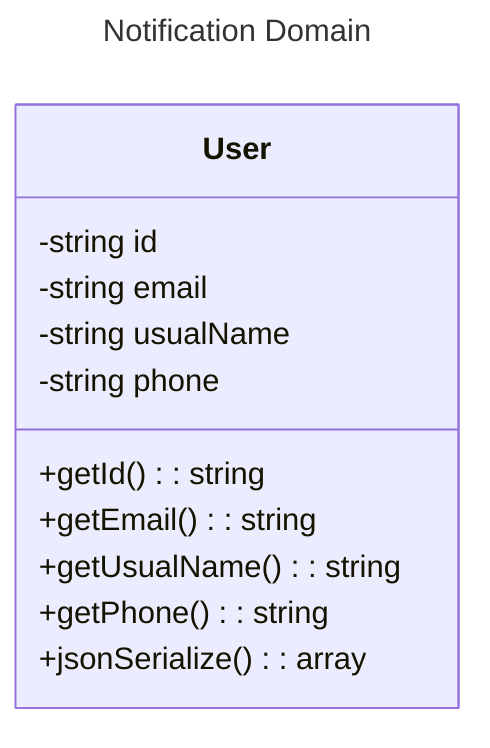

# Messenger
## Context

This project is an application designed to explore concepts such as Clean Architecture, Test-Driven Development (TDD), Domain-Driven Design (DDD), and Hexagonal Architecture. These approaches aim to produce maintainable, scalable, and testable code.

## Technologies

 - **PHP** : Programming language used for business logic.
 - **Composer** : Dependency manager for PHP.
 - **PHPUnit** : Tool for unit testing.
 - **Docker** : Containerization platform to simplify application execution and isolation.

## Key Concepts
### 1. Clean Architecture

Clean Architecture is a set of principles designed to organize code in a way that it is independent of frameworks, databases, and user interfaces. It enables:

 - Separation of concerns.
 - Easier testing.
 - More comprehensible and maintainable code.

### 2. Test-Driven Development (TDD)

TDD is a development methodology based on writing tests before coding the functionality. The process follows three steps:

 - Write a test that fails.
 - Write the minimum code necessary to make the test pass.
 - Refactor the code while ensuring the tests still pass.

TDD improves code quality and reduces the number of bugs.

### 3. Domain-Driven Design (DDD)

DDD is a software design approach focusing on the business domain. It encourages collaboration between developers and domain experts to:

 - Model the domain effectively.
 - Use a common language.
 - Structure code around business concepts.

### 4. Hexagonal Architecture

Hexagonal Architecture, or Ports and Adapters Architecture, separates the core application logic from external interactions (UI, databases, APIs, etc.). It allows:

 - Easier testing of the application core.
 - Replacement of external components without impacting business logic.
 - Simplified application evolution.

## Installation and Usage

This project composer

1. Clone the repository:
   ```bash
   git clone git@github.com:thetis20/notification-domain.git
   cd notification-domain
   ```

2. Install composer dependencies:
   ```bash
   composer install
   ```

3. Run tests
   ```bash
   composer run-script tests
   ```

## Class Diagram



## License
This project is licensed under the MIT License. Please refer to the LICENSE file for more information.